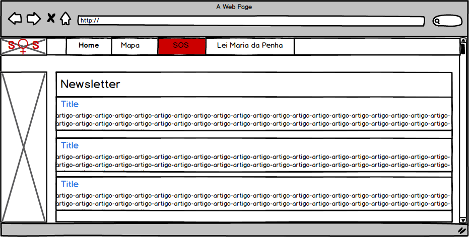
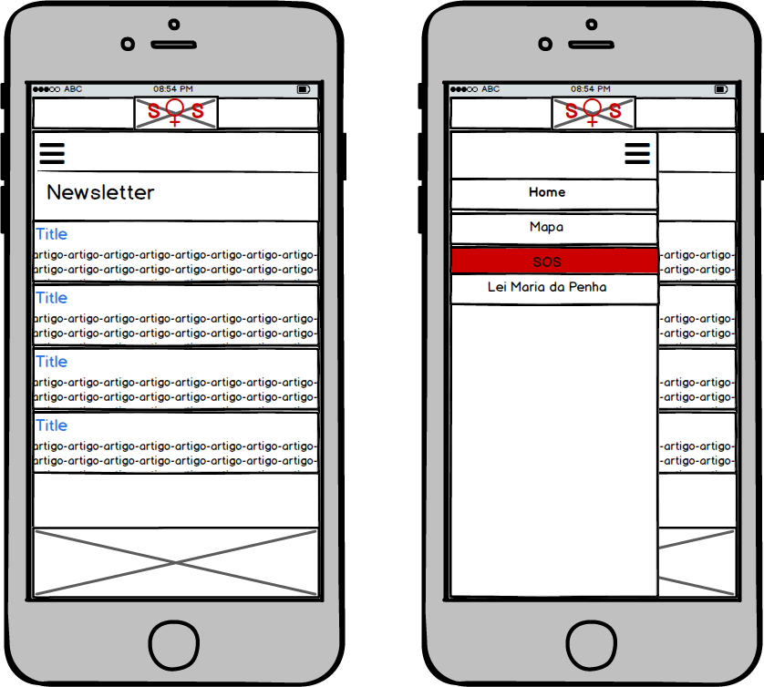
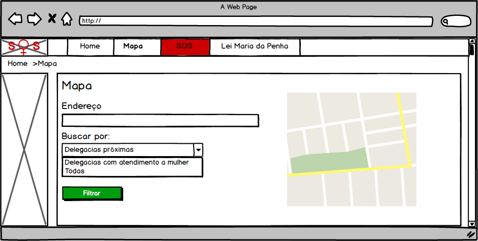
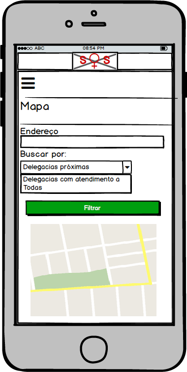
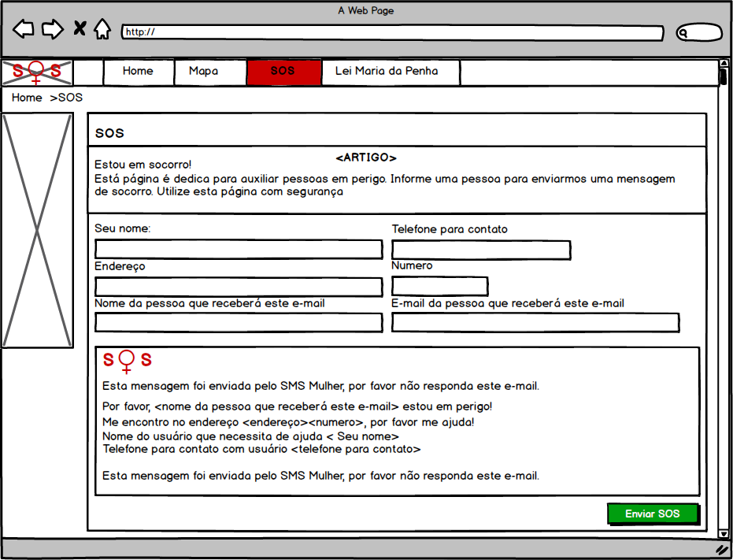
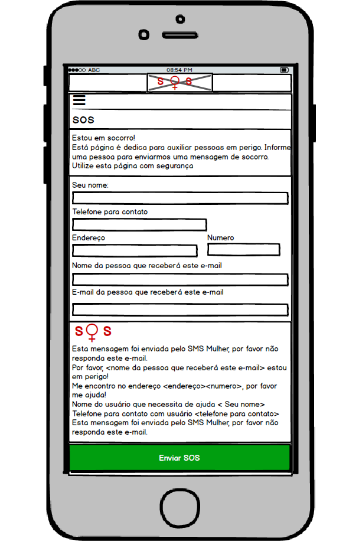
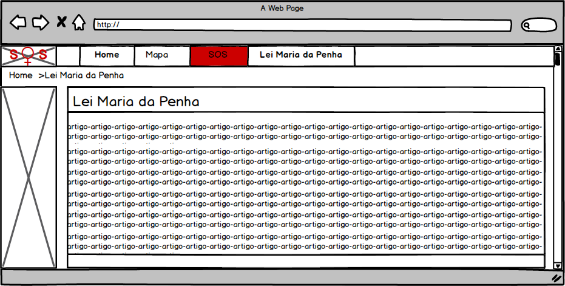
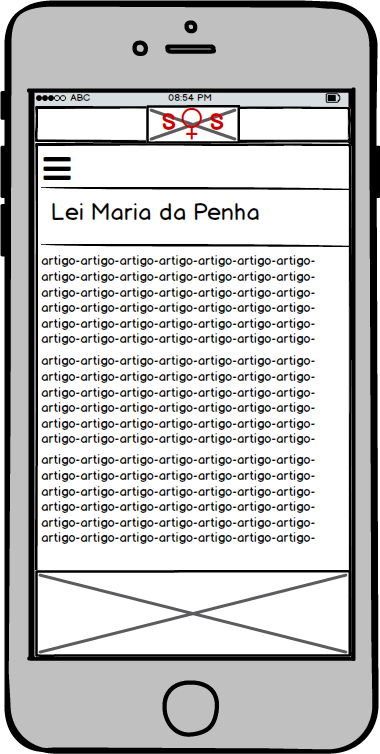

# Documento de Visão do Projeto "SOS Mulheres"

Este documento apresenta uma solução de software para o projeto *"SOS Mulheres"*, 
apresentando os problemas a serem solucionados, as necessidades dos principais envolvidos, o alcance do projeto e as funcionalidades 
esperadas do sistema.

## Objetivos

* Ampliar a funcionalidade do aplicativo web-based “SOS Mulher”  http://www.onumulheres.org.br/sosmulher/
  * Com base no site SOS Mulheres queremos acrescentar as funcionalidades de:
    * Newsletter com noticias de mulheres, que visa informar as mulheres sobre os principais acontecimentos envolvendo violência doméstica, como devem proceder quando um caso destes ocorrer, a quem recorrer, etc.
    * Mapas de delegacias que disponibiliza aos usuários as delegacias mais próximas, sejam as delegacias que atendem a todos ou alguma especifica somente ao genero feminino
    * "Botão de Panico" para informar um contato de emergência que o usuário em questão está em perigo
    * Informações sobre lei Maria da Penha, disponibilizar  a lei Maria da Penha para consulta.

## Problema

* Descrição do problema: Tendo em vista que muitos casos de violência doméstica não são denunciados por falta de informação de como proceder ou medo em denunciar o agressor, nosso sistema visa disponibilizar informações que encorajem as mulheres a denunciar e diminuir este problema.
* Quem é afetado pelo problema: A ampliação do projeto SOS Mulheres tem como foco auxiliar mulheres que sofrem de violencia domestica.
* Impacto no negócio: Desejamos coibir a violência doméstica e familiar contra a mulher.
* Benefícios de uma boa solução:
  * Auxiliar mulheres que sofrem de violencia domestica.
  * Informar as mulheres sobre a Lei Maria da Penha e seus beneficios de ajuda.
  * Diminuir na porcentagem de mulheres coagidas pelo medo da violencia domestica.

## Integração com outros sistemas

* API do Google Maps para disponibilizarmos a localização das delegacias
* API de newsletter do Google para trazer noticias referentes as mulheres de forma automática
 
## Interessados

* Mulheres coagidas pelo medo da violencia domestica
* Usuários que buscam informações referentes aos direitos das mulheres
* Usuários que querem saber onde tem uma delegacia próxima a sua localização
* Organizações que buscam informações pertinentes para auxiliar as mulheres nestes casos de violência
  * Amzol – Associação de Mulheres da Zona Leste
  * Associação Fala Mulher
  * Asbrad – Associação Brasileira de Defesa da Mulher, da Infância e da Juventude
  * Bem Me Quer
  * Casa da Mulher Lilith

## Usuários

* Mulheres que sofrem violencia domestica
* Ongs
* Usuários que buscam informações sobre a Lei Maria da Penha
* Usuárias que buscam ajuda a combater a violencia domestica

## Funcionalidades do produto

* Home Principal  
  * 
  Newsletter de noticias ligadas a mulher
* Mapas
  * Busca de delegacias 
* SOS
  * Envio de mensagem de socorro para usuário
* Lei Maria da Penha
  * Página em artigo para lei Maria da Penha

## Protótipos de tela

### Protótipos para Home Principal
* Versão Desktop     
    

* Versão Mobile     
    

Fonte: Mockup criado no software Balsamiq  

### Protótipos para Mapas  
* Versão Desktop     

* Versão Mobile  
  

Fonte: Mockup criado no software Balsamiq

### Protótipos para SOS
* Versão Desktop  

* Versão Mobile  

Fonte: Mockup criado no software Balsamiq

### Protótipos para Lei Maria da Penha
* Versão Desktop  

* Versão Mobile  

Fonte: Mockup criado no software Balsamiq

