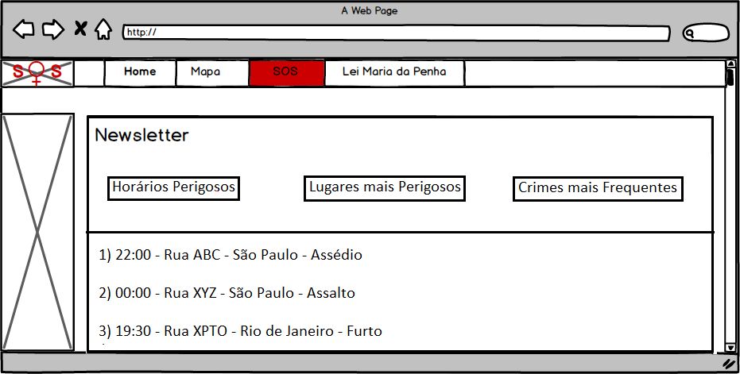

# Documento de Visão do Projeto "SOS Mulheres"

Este documento apresenta uma solução de software para o projeto *"SOS Mulheres"*, 
apresentando os problemas a serem solucionados, as necessidades dos principais envolvidos, o alcance do projeto e as funcionalidades 
esperadas do sistema.

## Objetivos

* Ampliar a funcionalidade do aplicativo web-based “SOS Mulher” 
* Site SOS Mulheres:
  * Newsletter com noticias de mulheres
  * Mapas de delegacias
  * "Botão de Panico"
  * Informações sobre lei Maria da Penha

## Problema

* Descrição do problema: Com este site queremos auxiliar mulheres que sofrem violencia domestica
* Quem é afetado pelo problema: estamos querendo resolver o problema de mulheres que sofrem violencia domestica
* Impacto no negócio: coibir a violência doméstica e familiar contra a mulher
* Benefícios de uma boa solução: Informar mulheres que sofrem violencia domestica seus direitos 

## Integração com outros sistemas

* API do Google Maps
* API de newsletter do Google
 
## Interessados

* Mulheres que sofrem violencia domestica 
* Pessoas que buscam informações sobre lei Maria da Penha

## Usuários

* Mulheres que sofrem violencia domestica

## Funcionalidades do produto

* Home Principal
  *Newsletter de noticias ligadas a mulher
* Mapas
  * Busca de delegacias 
* SOS
  * Envio de mensagem de socorro para usuário
* Lei Maria da Penha
  * Página em artigo para lei Maria da Penha

## Protótipos de tela

### Protótipos para Home Principal

Fonte: Mockup criado no software Balsamiq

### Protótipos para Mapas

Fonte: Mockup criado no software Balsamiq

### Protótipos para SOS

Fonte: Mockup criado no software Balsamiq

### Protótipos para Lei Maria da Penha

Fonte: Mockup criado no software Balsamiq

### Protótipos para funcionalidade N
