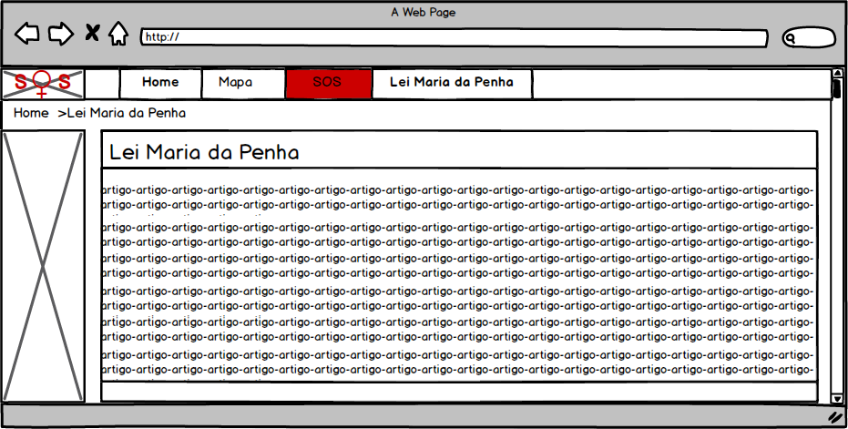

# Documento de Visão do Projeto "SOS Mulheres"

Este documento apresenta uma solução de software para o projeto *"SOS Mulheres"*, 
apresentando os problemas a serem solucionados, as necessidades dos principais envolvidos, o alcance do projeto e as funcionalidades 
esperadas do sistema.

## Objetivos

* Ampliar a funcionalidade do aplicativo web-based “SOS Mulher” 
* App que forneça informações sobre a "Lei Maria da Penha" e 
* App que mapeia as delegecias mais próximas da localização 

## Problema

* Descrição do problema: Mulheres que sofrem agressões 
* Quem é afetado pelo problema: Mulheres
* Impacto no negócio: Diminuir o numero de casos de violencia contra mulheres
* Benefícios de uma boa solução: Ao diminuir o numero de casos de violencia contra as mulheres, retiraremos

## Integração com outros sistemas

* API do Google Maps
 
## Interessados

* Mulheres que sofrem violencia

## Usuários

* Mulheres que sofrem violencia 

## Funcionalidades do produto

* Home Principal
  *Newsletter de noticias ligadas a mulher
* Mapas
  * Busca de delegacias 
* SOS
  * Envio de mensagem de socorro para usuário
* Lei Maria da Penha
  * Página em artigo para lei Maria da Penha

## Restrições do projeto

* Restrição 1
* Restrição 2
* Restrição 3
* etc.

## Protótipos de tela

### Protótipos para Home Principal

Fonte: Mockup criado no software Balsamiq

### Protótipos para Mapas

Fonte: Mockup criado no software Balsamiq

### Protótipos para SOS

Fonte: Mockup criado no software Balsamiq

### Protótipos para Lei Maria da Penha

Fonte: Mockup criado no software Balsamiq

### Protótipos para funcionalidade N
