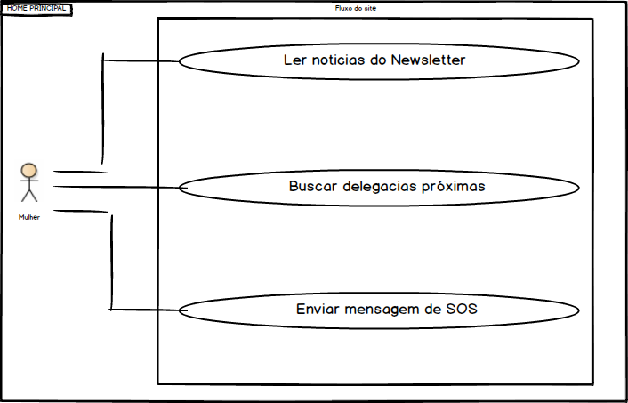

# Casos de uso

## 1. Diagrama de casos de uso

**Instruções do professor**: Insira abaixo o diagrama com os casos de uso do seu sistema. A imagem abaixo é somente um exemplo.

## 2. Especificação dos casos de uso

**Instruções do professor**: Para cada caso de uso, criar as tabelas com a especificação do caso de uso. Siga o exemplo dado abaixo:

### 2.1. Caso de uso **BUSCAR DELEGACIAS PRÓXIMAS**

| Campo          | Informação        |
|---|---|
| Identificador: | UC01              |
| Nome:          | Buscar delegacias |
| Atores:        | Interessado em saber localização das delegacias  |
| Sumário:       | Busca delegacias próximas de sua localização |

| Fluxo Principal |
|---|
| 1) Usuário clica na opção de buscar delegacias. |
| 2) O sistema recupera as informações de localização através da API do Google.               |
| 3) Usuário aplica os filtros necessários, se deseja as delegacias comuns, somente para mulheres ou todas.|
| 4) O sistema apresenta as delegacias de acordo com o filtro mais próximas de seu localização. |

| Fluxo Alternativo (2a): O sistema não encontra a localização. |
|---|
| 1) O sistema informa que não conseguiu recuperar as informações de localização. |
| 2) Sistema informa que talvez o usuario tenha que permitir ao site que obtenha sua localização. |
| 3) Usuário checa se a opção está ativada. |
| 4) Volta ao passo (2) do fluxo principal. |

### 2.2. Caso de uso **ENVIAR MENSAGEM SOS**

| Campo          | Informação        |
|---|---|
| Identificador: | UC02              |
| Nome:          | Enviar mensagem SOS |
| Atores:        | Vitima do ataque  |
| Sumário:       | Envia email de socorro |

| Fluxo Principal |
|---|
| 1) Usuário clica na opção de enviar mensagem de socorro. |
| 2) O sistema apresenta um formulário com as informações a serem preenchidas.        |
| 3) Usuário preenche os campos com suas informações e o email de quem quer que recebe a mensagem.|
| 4) O sistema envia a mensagem de socorro ao contato e apresenta uma mensagem de concluido com sucesso. |

| Fluxo Alternativo (2a): O sistema não consegue enviar o email. |
|---|
| 1) O sistema informa que não conseguiu enviar o email. |
| 2) Sistema informa que talvez o email do destinatário esteja incorreto. |
| 3) Usuário checa se a email está correto. |
| 4) Volta ao passo (2) do fluxo principal. |

### 2.3. Caso de uso *Filtrar Crimes Ocorridos no Newsletter*

| Campo          | Informação        |
|---|---|
| Identificador: | UC03              |
| Nome:          | Filtrar ocorrências |
| Atores:        | Vitima do Ataque |
| Sumário:       | Visualizar o Ranking de ocorrências |

| Fluxo Principal |
|---|
| 1) O usuário clica em uma das 3 opções: "Horário Perigosos", "Lugares mais Perigosos" e "Crimes mais Frequentes". |
| 2) O sistema filtra as ocorrências registradas baseada na opção que o usuário clicou.                   |
| 3) O sistema apresenta as informações da hora, local e tipo de crime em um ranking com no máximo 10 posições. |

| Fluxo Alternativo (2a)|
|---|
| 1) O usuário clica em "Horários Perigosos". |
| 2) O sistema lista até 10 ocorrências mais frequentes em faixas de horário.                   |
| 3) O sistema apresenta as informações da hora, local e tipo de crime em um rank baseado nos horários com mais registros. |

| Fluxo Alternativo (2b)|
|---|
| 1) O usuário clica em "Lugares mais Perigosos". |
| 2) O sistema lista até  10 endereços (nome do local e estado) com mais ocorrências.                   |
| 3) O sistema apresenta as informações da hora, local e tipo de crime em um rank baseado nos endereços com mais registros. |

| Fluxo Alternativo (2c)|
|---|
| 1) O usuário clica em "Crimes mais Frequentes". |
| 2) O sistema lista até 10 tipos de crimes mais recorrentes.                   |
| 3) O sistema apresenta as informações da hora, local e tipo de crime em um rank baseado nos crimes com mais registros. |

**Instruções do professor**: As tabelas acima mostram um exemplo de especificação de **um único caso de uso**. Lembre-se de especificar cada um dos casos de uso.

